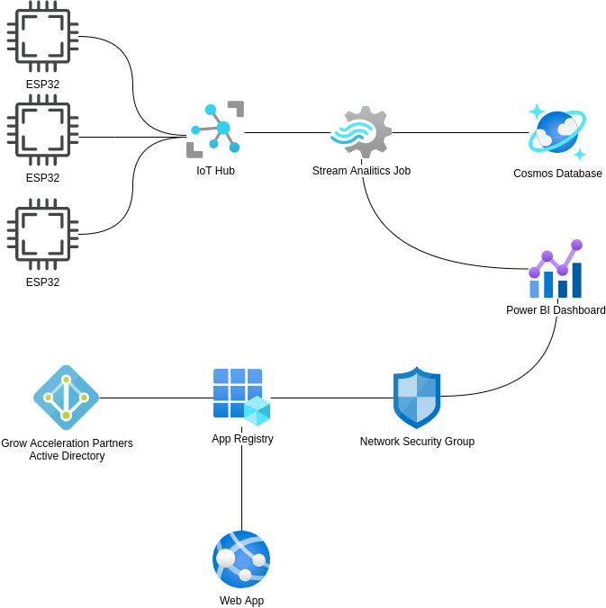
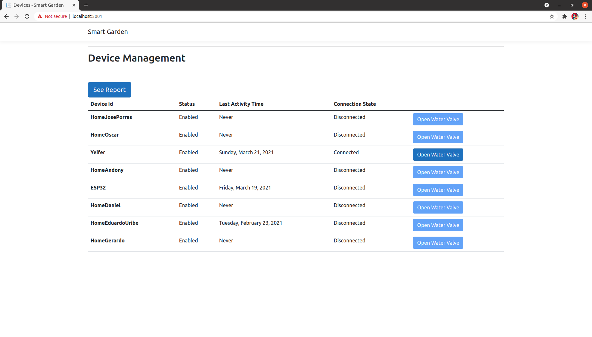
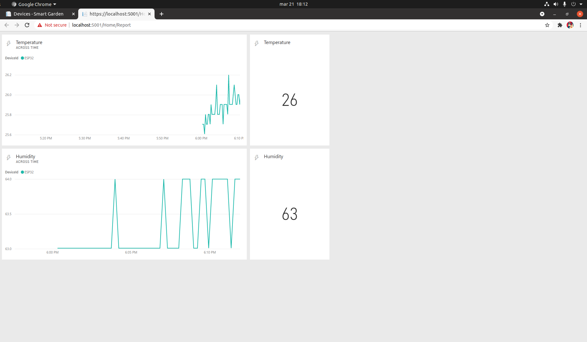

# SmartGarden
This is a project is compose of a telemetric device and a web application. I built this in GAP Labs. it was designed to use an ESP32, an humidity sensor and a soil moisture sensor to control how much water do I use in a plant.

## Prerequisites 
1. Computer with .NET 5.0 framewor, VS Code and PlatformIO plugin installed
2. Azure Account

## Telemetric Device Schematic


## Azure Configuration 


## Web App Configuration
For the web application located in Azure/Web/App/src/appsettings.json configure the following values:

```
{
  "Logging": {
    "LogLevel": {
      "Default": "Information",
      "Microsoft": "Warning",
      "Microsoft.Hosting.Lifetime": "Information"
    }
  },
  "AllowedHosts": "*",
  "PowerBIOptions": {
    "ApiUrl": "https://api.powerbi.com",
    "DashboardId": "[Power BI Dashboard ID]",
    "WorkspaceId": "[Power BI Workspace ID]",
    "DatasetId": "[Power BI Dataset ID]"
  },
  "AzureADOptions": {
    "TenantUrl": "https://login.microsoftonline.com/[Azure Tenant ID]/",
    "Scope": ["https://analysis.windows.net/powerbi/api/.default"],
    "AuthorityUrl": "https://login.microsoftonline.com/[Azure Tenant ID]/",
    "AuthenticationMode": "masteruser",
    "Password": "[Master Account Password]",
    "Username": "[Master Account Username]"
  },
  "IotHubOptions": {
    "ConnectionString": "[Iot Hub Connection String]"
  }
}

```
## Telemetric Device Configuration
For the telemetric device you must configure the following values:

```
const char* ssid     = "[Wifi Name]";
const char* password = "[SSID Password]"
const int waterPin = 32;

//  Iot Hub settings
static const char* connectionString = "[Device Iot Hub Connection String]";
```

## Screenshots



